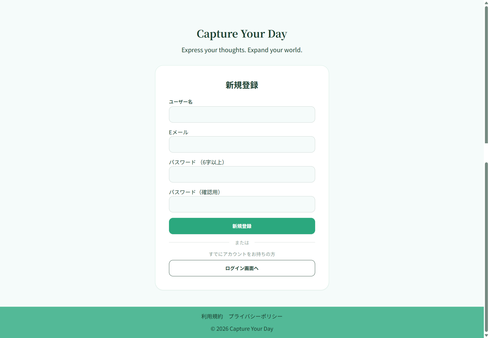
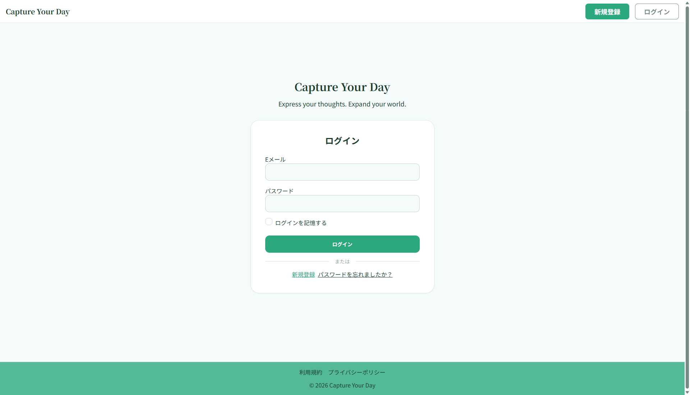
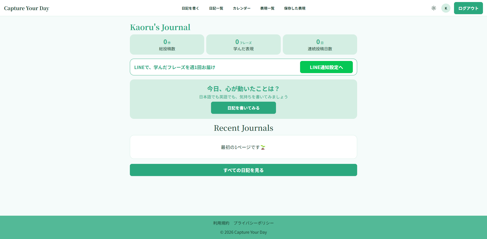
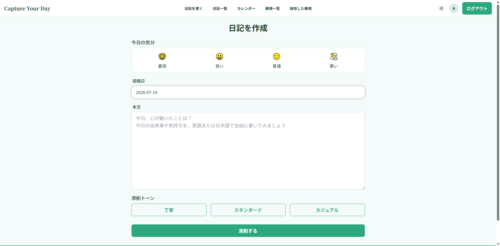
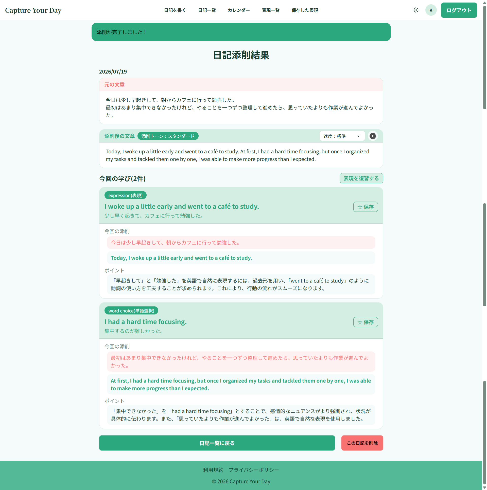
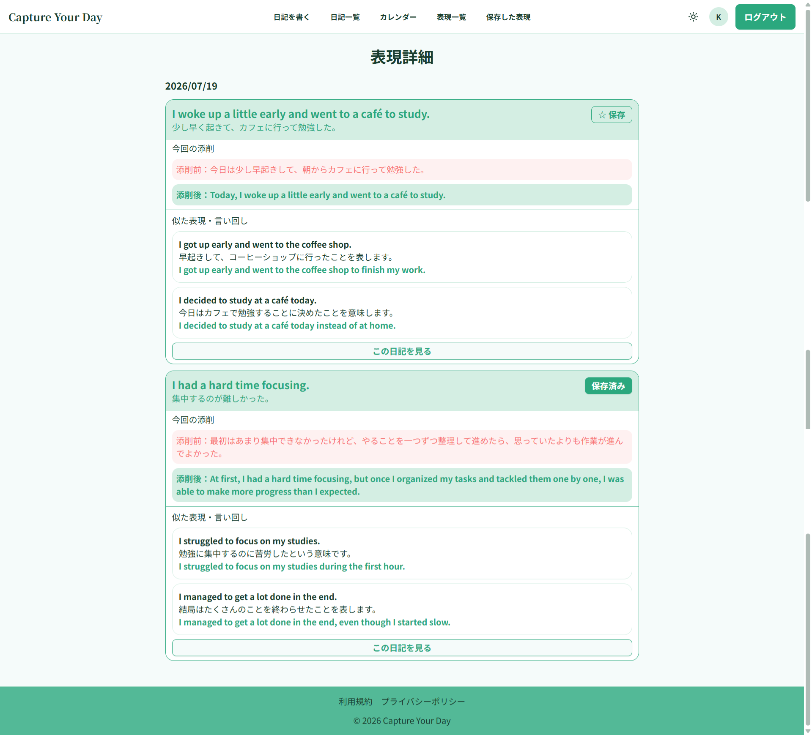
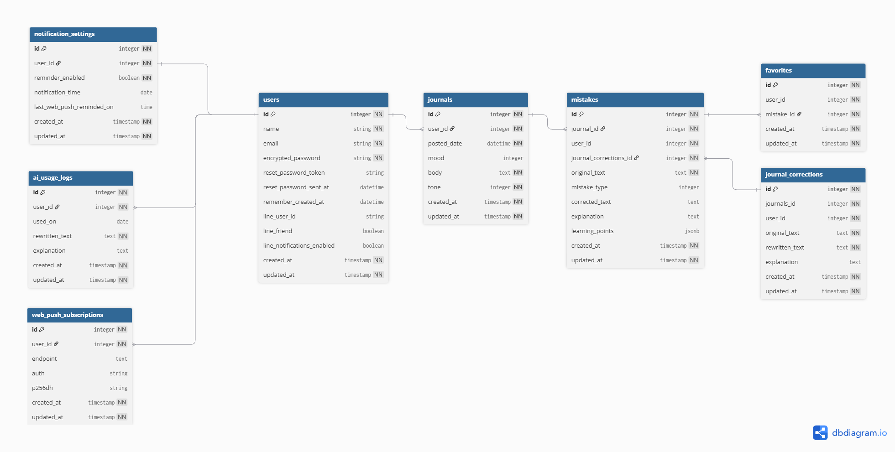

# Capture Your Day
#### AI添削で学んだ英語表現を蓄積・復習し、アウトプットを習慣化する英語ジャーナリングアプリ

---
# アプリURL
https://capture-your-day.onrender.com/

---
# サービス概要

 日々の出来事や感情を英語あるいは日本語で入力し、AI添削と英語表現の振り返りを通して、英語アウトプットを習慣化するジャーナリングアプリです。

 AI添削でより自然な英語の表現を学び、関連する類似英語表現とあわせて学ぶことで、自分の英語表現の幅を少しずつ増やしていくことができます。 
 また、覚えたい表現をお気に入りに登録し、アプリ内での振り返りやLINEの週次通知を通して復習できます。 
 「日記を書く → AIで添削 → より自然な表現を学ぶ → 振り返る」という学習サイクルを作ることで、間違いを恐れずに英語を使い続けられる環境を目指しています。

 毎日の小さなアウトプットを積み重ねながら、英語で自分の気持ちを表現する自信を育てていくことを目的としています。

# 開発背景

  これまでの英語学習の中で、知識として身につけた英語を実際のスピーキングやライティングで思うように使えないという課題を感じていました。 
  その原因を振り返ると、間違えることへの恥ずかしさや、失敗したときの落胆を避けたいという気持ちから、英語を話すこと自体に消極的になっていたことに気づきました。また、オンライン英会話などでは、十分なフィードバックが得られなかったり、自分の間違いを振り返る仕組みがなく、その場限りの学習になってしまうことも課題でした。

  語学学習では、間違いながらアウトプットし、そこから学んだことを繰り返し振り返ることが大切です。
  そこで、対人コミュニケーションよりも間違いへの心理的負担が少ないAIを活用し、安心して英語をアウトプットできる環境を作りたいと考えました。 
  「英語で日記を書く → AI添削を受ける → より自然な表現を学ぶ → 振り返る」という学習サイクルを通して、間違いを失敗ではなく学びとして蓄積し、英語を使うことへの心理的なハードルを下げることを目指して、このサービスを開発しました。

# ターゲット層
- TOEIC600以上で英語の読み・聞きはある程度できるものの、英語で自分の考えや感情のアウトプットをする機会が少ない英語学習者
- 特に留学希望の学生や、将来ワーキングホリデー・海外就職を考えている20代～30代の学習者を想定しています。

# 主な機能
 | 新規登録画面 | 
 | :---: |  
 |  |
 |名前、メールアドレス、パスワード、確認用パスワードを入力してユーザー登録を行います。|

 | ログイン画面 | 
 | :---: |             
 |  | 
 |登録したメールアドレスとパスワードでログインできます。|

 | ホーム画面 | 
 | :---: |             
 |  | 
 |これまでに書いた日記の数、学んだ表現数などの学習成果を確認・振り返れます。日記を書くハードルを下げるために英語だけではなく日本語でもOKにしています。|

 | ジャーナリング作成画面 | 
 | :---: |             
 |  | 
 |添削時の英語のトーンを「丁寧」「スタンダード」「カジュアル」から選んでAI添削します。|

 | AI添削結果画面 | 
 | :---: |   
 |  |
 |書いた日記に対してAIがより自然な英語表現をいくつかピックアップします。その表現を保存してあとから復習することができます。|

 | 保存した表現画面 | 
 | :---: |   
 |  |
 |保存した表現ページに、その表現に似た言い回しを2つ提案しています。1つの英語表現から複数の言い回しを学び、表現の選択肢を増やせます。|

---

# 技術構成

| カテゴリ | 技術 | 用途 |
|----------|------|------|
| バックエンド | Ruby on Rails 8.1.3 | サーバーサイド |
| DB | PostgreSQL | データ管理 |
| フロントエンド | Tailwind CSS / DaisyUI / JavaScript | UI構築 |
| 認証 | Devise | ユーザー認証 |
| AI | OpenAI API | 英文添削・類似表現の提案 |
| 外部連携 | LINE Login API / Messaging API | Web Push API |学習内容の通知|
| ページネーション | Kaminari |一覧のページ分割|
| インフラ | Docker | 開発環境 |
| デプロイ先 | Render | デプロイ |
---
# サービスの差別化

  ### 1. 添削から学ぶべき表現をピックアップ

  AIが英文を添削表示する際に、より自然な英語表現をピックアップします。添削結果の表示だけではなく、学習すべきポイントを把握できます。

  ### 2. 類似表現から表現の幅を広げられる

  ピックアップされた表現に関連する類似表現も提案します。1つの表現から複数の類似した言い回しを学び、表現の選択肢を増やせます。

  ### 3. 学んだ表現を蓄積して復習できる

  覚えたい表現を保存し、アプリ内やLINE通知から繰り返し復習できます。添削を一度きりで終わらせず、自分だけの英語表現として蓄積できます。

---
# 画面遷移図
 [画面遷移図を見る（Figma）](https://www.figma.com/design/TjLw7rU7eSfo8SfXsBOaIG/capture-ur-day%E7%94%BB%E9%9D%A2%E9%81%B7%E7%A7%BB%E5%9B%B3-%E5%8E%9F%E6%9C%AC---%E6%8F%90%E5%87%BA-?node-id=4-3&t=wfZBgZqFxPJJ9ble-1)

---
# ER図
