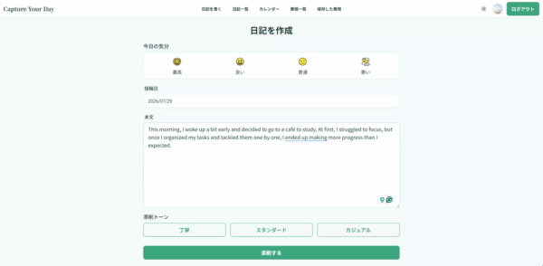

# Capture Your Day
#### AI添削で学んだ英語表現を蓄積・復習し、アウトプットを習慣化する英語ジャーナリングアプリ

---
# アプリURL
https://capture-your-day.onrender.com/

---
# サービス概要

 日々の出来事や感情を英語あるいは日本語で入力し、AI添削と英語表現の振り返りを通して、英語アウトプットを習慣化するジャーナリングアプリです。

 添削から学んだ表現や類似表現を保存し、アプリ内やLINE通知で繰り返し復習できます。
「書く・学ぶ・蓄積する・振り返る」という学習サイクルによって、実際に使える英語表現を少しずつ自分の引き出しに増やしていくことを目指しています。

# 開発背景

  私自身、TOEIC970点を取得していますが、知識として身につけた英語を、実際のスピーキングやライティングで自分の言葉として使うことに課題を感じていました。 
  その原因を振り返ると、間違えることへの恥ずかしさや、失敗したときの落胆を避けたいという気持ちから、英語を話すこと自体に消極的になっていたことに気づきました。また、オンライン英会話などでは、十分なフィードバックが得られなかったり、自分の間違いを振り返る仕組みがなく、その場限りの学習になってしまうことも課題でした。

  語学学習では、間違いながらアウトプットし、そこから学んだことを繰り返し振り返ることが大切です。
  そこで、対人コミュニケーションよりも間違いへの心理的負担が少ないAIを活用し、安心して英語をアウトプットできる環境を作りたいと考えました。 
  「英語で日記を書く → AI添削を受ける → より自然な表現を学ぶ → 振り返る」という学習サイクルを通して、間違いを失敗ではなく学びとして蓄積し、英語を使うことへの心理的なハードルを下げることを目指して、このサービスを開発しました。

# ターゲット層
- TOEIC600以上で英語の読み・聞きはある程度できるものの、英語で自分の考えや感情のアウトプットをする機会が少ない英語学習者
- 特に留学希望の学生や、将来ワーキングホリデー・海外就職を考えている20代～30代の学習者を想定しています。

# 主な機能
 | 新規登録画面 | 
 | :---: |  
 |  |
 |
名前、メールアドレス、パスワード、確認用パスワードを入力してユーザー登録を行います。
|

 | ログイン画面 | 
 | :---: |             
 |  | 
 |
登録したメールアドレスとパスワードでログインできます。
|

 | ホーム画面 | 
 | :---: |             
 |  | 
 |
これまでに書いた日記の数、学んだ表現数などの学習成果を確認・振り返れます。 日々積み重ねてきたアウトプットを数値で振り返ることで、学習の継続やモチベーションの維持につなげます。
|

 | ジャーナリング作成画面 | 
 | :---: |             
 |  | 
 |
英文を添削する際に「丁寧」「スタンダード」「カジュアル」の3つのトーンを選択できます。 選択したトーンに合わせて、AIがより自然な英文に添削します。
|

 | AI添削結果画面 | 
 | :---: |   
 |  |
 |
元の表現と添削後の表現を比較することで、自分が伝えたい内容に合った実践的な英語表現を学べます。 また、添削された表現の中から覚えたい表現を保存し、自分の英語表現として蓄積して繰り返し復習できます。
  
|

 | 保存した表現画面 | 
 | :---: |   
 |  |
 |
保存した表現に対して、その表現に似た言い回しを2つ提案します。 1つの英語表現だけを覚えるだけではなく、複数の言い回しを関連付けて学ぶことで、英語表現の幅を広げられます。
|

---

# 技術構成

| カテゴリ | 技術 | 用途 |
|----------|------|------|
| バックエンド | Ruby on Rails 8.1.3 | サーバーサイド |
| DB | PostgreSQL | データ管理 |
| フロントエンド | Tailwind CSS / DaisyUI / JavaScript | UI構築 |
| 認証 | Devise | ユーザー認証 |
| AI | OpenAI API | 英文添削・類似表現の提案 |
| 外部連携 | LINE Login API / Messaging API | LINEアカウント連携 / 保存した英語表現の週次通知 |
| 通知 | Web Push API |リマインド通知|
| ページネーション | Kaminari |一覧画面のページ分割|
| インフラ | Docker | 開発環境 |
| デプロイ先 | Render | デプロイ |
---
# サービスの差別化

  ### 1. 添削から学ぶべき表現をピックアップ

  AIが英文を添削表示する際に、より自然な英語表現をピックアップします。添削結果の表示だけではなく、学習すべきポイントを把握できます。

  ### 2. 1つの表現から類似表現を学び、表現の幅を広げられる

  ピックアップされた表現に関連する類似表現も提案します。1つの表現から複数の類似した言い回しを学び、表現の選択肢を増やせます。

  ### 3. 学んだ表現を蓄積して復習できる

  覚えたい表現を保存し、アプリ内やLINE通知から繰り返し復習できます。添削を一度きりで終わらせず、自分の英語表現として蓄積できます。

  ### 4. 日本語でも書ける
  英語で表現することが難しい場合は、日本語で日記を書くこともできます。 
  AIが日本語のニュアンスを保ちながら英文添削するため、英語が思い浮かばないときも無理なく続けられます。

---
# 画面遷移図
 [画面遷移図を見る（Figma）](https://www.figma.com/design/TjLw7rU7eSfo8SfXsBOaIG/capture-ur-day%E7%94%BB%E9%9D%A2%E9%81%B7%E7%A7%BB%E5%9B%B3-%E5%8E%9F%E6%9C%AC---%E6%8F%90%E5%87%BA-?node-id=4-3&t=wfZBgZqFxPJJ9ble-1)

---
# ER図
